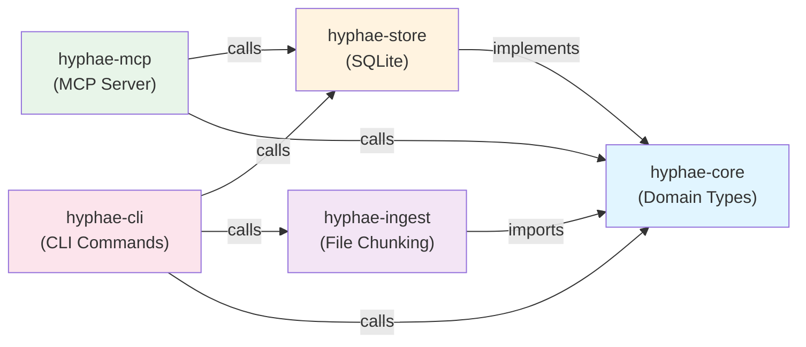
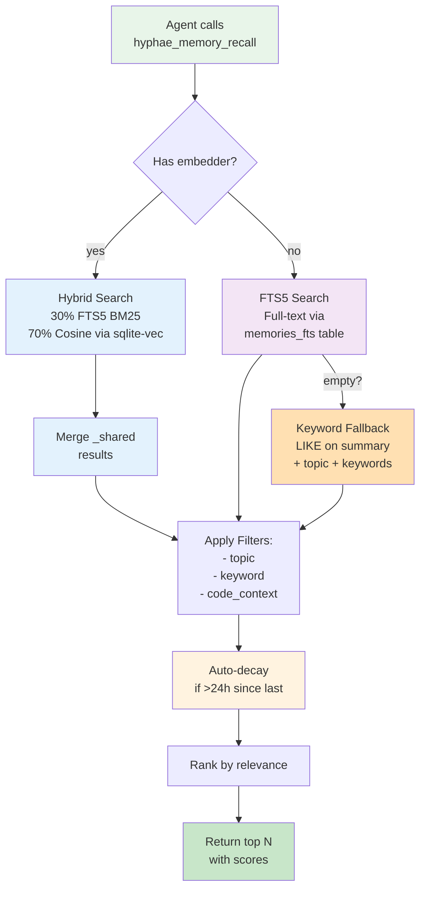
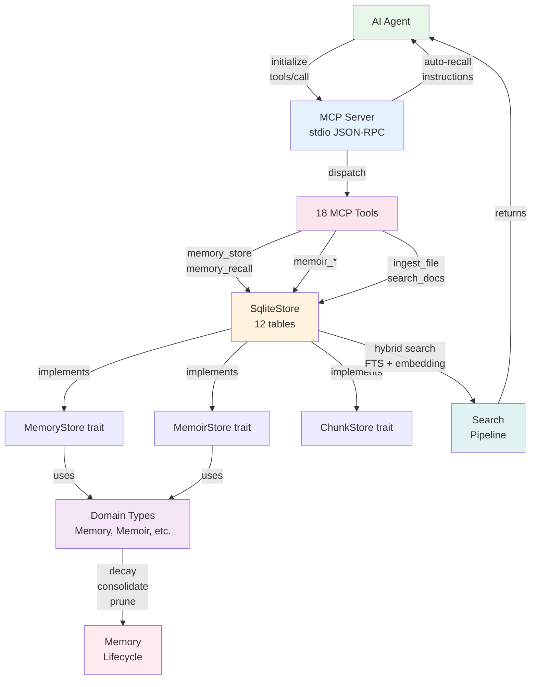

# Hyphae Internals

This document describes how Hyphae's architecture works internally. It's written for contributors and maintainers who need to understand the system at each layer.

## Table of Contents

1. [Crate Architecture](#crate-architecture)
2. [MCP Server Loop](#mcp-server-loop)
3. [Auto-Context Injection](#auto-context-injection)
4. [Memory Lifecycle](#memory-lifecycle)
5. [Search Pipeline](#search-pipeline)
6. [Memoir System](#memoir-system)
7. [RAG Pipeline](#rag-pipeline)
8. [Nudge and Lesson Systems](#nudge-and-lesson-systems)

---

## Crate Architecture

Hyphae is organized as a 5-crate Rust workspace. Each crate has clear responsibilities and minimal cross-dependencies.

### Dependency Graph



### Crate Responsibilities

#### hyphae-core

Pure domain types and trait definitions. **No I/O, no database, no networking.**

| Item | Purpose |
|------|---------|
| `Memory` | Time-scoped episodic memory with importance and decay |
| `Memoir` | Permanent knowledge graph (no decay) |
| `Concept` | Node in a memoir (e.g., "AuthService") |
| `ConceptLink` | Directed edge between concepts (e.g., "calls") |
| `Importance` | Five-level decay rate (Critical > High > Medium > Low > Ephemeral) |
| `Weight` | [0,1] score tracking memory relevance |
| `Label` | Semantic tag on concepts (e.g., "class", "function", "pattern") |
| `Relation` | Concept link type (e.g., "calls", "implements", "inherits") |
| `MemoryStore` trait | Abstract interface for memory CRUD + search + decay |
| `MemoirStore` trait | Abstract interface for memoir graph operations |
| `Embedder` trait | Abstract embedding interface (fastembed or HTTP) |
| `ChunkStore` trait | Abstract RAG chunk storage |

**Feature gates:**
- `embeddings` (default): Enables `FastEmbedder` via fastembed. Adds ~2GB to debug build. Disable with `--no-default-features` for fast iteration on non-embedding code.

---

#### hyphae-store

`SqliteStore` implements `MemoryStore`, `MemoirStore`, and `ChunkStore` traits. Manages all persistence.

**Schema: 12 tables**

| Table | Purpose | Key Fields |
|-------|---------|-----------|
| `memories` | Main episodic memory store | `id`, `topic`, `summary`, `importance`, `weight`, `project` |
| `memories_fts` | Full-text search virtual table | FTS5 index on topic, summary, keywords |
| `vec_memories` | Vector embeddings for cosine search | `memory_id`, `embedding` (sqlite-vec) |
| `memoirs` | Knowledge graph headers | `id`, `name`, `description` |
| `concepts` | Graph nodes | `id`, `memoir_id`, `name`, `definition`, `labels`, `revision`, `confidence` |
| `concept_links` | Directed edges between concepts | `id`, `source_id`, `target_id`, `relation`, `weight` |
| `documents` | Source documents for RAG | `id`, `source_path`, `source_type`, `project` |
| `chunks` | Document chunks (pre-computed embeddings) | `id`, `document_id`, `content`, `embedding` |
| `chunks_fts` | Full-text search for chunks | FTS5 index on content |
| `vec_chunks` | Vector embeddings for chunk cosine search | `chunk_id`, `embedding` (sqlite-vec) |
| `sessions` | Session metadata | `id`, `created_at`, `project`, `summary` |
| `hyphae_metadata` | Housekeeping metadata | `key`, `value` (e.g., `last_decay_at`) |

**Schema initialization:**
- `init_db()` called on startup (auto-migrations via schema versioning)
- `init_db_with_dims(conn, embedding_dims)` for custom embedding dimensions (default 384 for fastembed)
- All operations wrapped in transactions with `PRAGMA foreign_keys=ON`

---

#### hyphae-ingest

File readers and chunking logic. **Pure logic, no database I/O.**

| Function | Purpose |
|----------|---------|
| `ingest_file(path, embedder)` | Read a single file, chunk it, embed chunks. Returns `(Document, Vec<Chunk>)` |
| `ingest_directory(path, embedder, recursive)` | Walk directory, ingest matching files. Skip binary/large files via `should_skip()` |
| `should_skip(path)` | Predicate: skip `.git`, `node_modules`, binaries, images, etc. |

**Chunking strategies:**

| Strategy | Use Case | Parameters |
|----------|----------|-----------|
| SlidingWindow | Code, prose | window_size=512, overlap=64 |
| ByHeading | Markdown | Splits on `# ## ###` headings |
| ByFunction | Code | Splits on function/method boundaries |

Auto-detect strategy from file extension (`.md` → ByHeading, `.rs`/`.py` → ByFunction, default SlidingWindow).

---

#### hyphae-mcp

JSON-RPC 2.0 MCP server. Reads stdin, dispatches tool calls, writes stdout.

**Architecture:**
- `run_server(store, embedder, compact, project)` blocks on stdin
- `handle_initialize()` returns protocol version, capabilities, and auto-recall instructions
- `handle_tools_list()` returns 18 tool definitions
- `handle_tools_call()` routes to tool implementation, applies store nudge

**18 Tools (9 memory + 9 memoir):**

| Tool | Purpose |
|------|---------|
| `hyphae_memory_store` | CRUD: create/update memory |
| `hyphae_memory_recall` | Query with FTS, hybrid, or keyword search |
| `hyphae_memory_forget` | Delete memory by ID |
| `hyphae_memory_update` | Update existing memory |
| `hyphae_memory_consolidate` | Merge redundant memories in a topic |
| `hyphae_memory_list_topics` | List all topics and memory counts |
| `hyphae_memory_stats` | Database statistics |
| `hyphae_recall_global` | Search across all projects |
| `hyphae_extract_lessons` | Group corrections/errors into lessons |
| `hyphae_memoir_create` | Create empty knowledge graph |
| `hyphae_memoir_list` | List all memoirs |
| `hyphae_memoir_show` | Display memoir with all concepts |
| `hyphae_memoir_add_concept` | Add node to graph |
| `hyphae_memoir_link` | Create directed edge |
| `hyphae_memoir_inspect` | BFS traversal from concept |
| `hyphae_memoir_search` | FTS search concepts across all memoirs |
| `hyphae_memoir_refine` | Update concept definition/confidence |
| `hyphae_ingest_file` | Import and chunk a file or directory |
| `hyphae_search_docs` | Search ingested document chunks |

---

#### hyphae-cli

29 CLI commands via clap derive. Installed as `hyphae` binary.

| Command | Purpose |
|---------|---------|
| `hyphae store --topic T --content C` | Manual memory storage |
| `hyphae search QUERY` | Search memories |
| `hyphae stats` | Show database statistics |
| `hyphae decay` | Apply importance-based decay |
| `hyphae prune --threshold 0.3` | Delete low-weight memories |
| `hyphae consolidate --topic T` | Merge redundant memories |
| `hyphae memoir create --name N` | Create knowledge graph |
| `hyphae memoir add-concept --memoir M --name N --definition D` | Add node to graph |
| And 20+ more... |

---

## MCP Server Loop

The MCP server is the main entry point for AI agents using Hyphae.

```
stdin line
  ↓
JSON parse (error → JSON-RPC parse error)
  ↓
Extract: method, id, params
  ↓
Route by method:
  ├─ "initialize" → handle_initialize()
  ├─ "ping" → return {}
  ├─ "tools/list" → handle_tools_list()
  └─ "tools/call" → handle_tools_call()
  ↓
Tool dispatch (if tools/call):
  ├─ memory.rs: store, recall, forget, update, consolidate, list_topics, stats, extract_lessons
  ├─ memoir.rs: create, list, show, add_concept, link, inspect, search, refine, import_code_graph
  ├─ ingest.rs: ingest_file, search_docs, list_sources
  ├─ session.rs: session_end, session_context
  └─ context.rs: recall_global, expand_with_code_context
  ↓
Apply nudge + consolidation hint
  ↓
Serialize result → JSON-RPC response
  ↓
stdout line
```

### Request/Response Format

**Request (line-delimited JSON-RPC 2.0):**
```json
{"jsonrpc":"2.0","id":1,"method":"tools/call","params":{"name":"hyphae_memory_store","arguments":{"topic":"decisions/myapp","content":"Use event sourcing","importance":"high"}}}
```

**Response:**
```json
{"jsonrpc":"2.0","id":1,"result":{"content":[{"type":"text","text":"Stored memory: mem_abc123def456"}]}}
```

### Key Parameters

| Parameter | Type | Scope | Example |
|-----------|------|-------|---------|
| `compact` | bool | Global | `--compact` flag for shorter output |
| `project` | String | Global | Auto-detect from cwd or set explicitly |
| `calls_since_store` | u32 | Session | Increments after each non-store tool; reset to 0 on store |

---

## Auto-Context Injection

On `initialize`, the server queries the database and appends recent context to the instructions returned to the agent.

### Initialization Flow

```
initialize request
  ↓
initial_context(store, project):
  ├─ Session context: recent 3 sessions (or fallback to session/{project} topic)
  ├─ Decisions: top 3 from decisions/{project} topic (truncate to 200 chars each)
  ├─ Errors: top 3 from errors/resolved topic
  └─ Project context: top 5 from context/{project} topic
  ↓
Format into readable string (newline-delimited)
  ↓
Append to HYPHAE_INSTRUCTIONS constant
  ↓
Return as part of initialize response
```

### Example Auto-Recall Output

```
[Hyphae Auto-Recall for this session]
Recent sessions:
- Session ending: 42 messages, 5 files modified, 2 errors (both resolved)
- Session 2 hours ago: built feature X, created 3 memoirs, 0 errors
- Session yesterday: refactored auth service

Key decisions:
- Use CQRS pattern for domain logic to decouple reads/writes
- Store session metrics in hyphae_store instead of logs for better recall

Recently resolved errors:
- Fixed port 5432 conflict with existing Postgres by binding to 5433...
- Resolved circular import in service discovery by extracting interface...
```

### Topics Queried

| Topic | Purpose | Fallback |
|-------|---------|----------|
| `session/{project}` | Session metadata and summaries | queries `sessions` table directly |
| `decisions/{project}` | Architectural decisions made in this project | None |
| `errors/resolved` | Errors successfully debugged and fixed | None |
| `context/{project}` | General project context notes | None |

---

## Memory Lifecycle

Memories flow through four stages: creation, decay, consolidation, and pruning.

### Stage 1: Creation

An agent stores a memory via `hyphae_memory_store`:

```rust
// Agent call
hyphae_memory_store(
  topic: "decisions/myapp",
  content: "Use event sourcing for audit trail",
  importance: "high",      // Critical/High/Medium/Low/Ephemeral
  keywords: ["pattern", "architecture"],
  raw_excerpt: "<commit hash or link>"
)

// Internal flow
Memory::builder()
  .topic("decisions/myapp")
  .summary(content)
  .importance(Importance::High)
  .keywords(["pattern", "architecture"])
  .raw_excerpt("...")
  .embedding(embedder.embed(content))  // auto-embed if embedder available
  .project(auto_detect_project())
  .build()

store.store(memory)  // Insert into memories + vec_memories tables
```

**Auto-deduplication:** If a very similar memory already exists in the same topic (cosine similarity > 0.85), update it instead of creating a duplicate.

---

### Stage 2: Decay

Memories decay over time based on importance level. Decay happens automatically on recall if >24h since last decay.

**Decay formula:**
```
effective_decay_rate = base_decay × importance_multiplier / (1 + access_count × 0.1)

base_decay = 0.95 (i.e., 5% loss per decay cycle)

importance_multiplier:
  Critical   → 0.0   (never decays)
  High       → 0.5x  (slow decay)
  Medium     → 1.0x  (normal decay)
  Low        → 2.0x  (fast decay)
  Ephemeral  → expires_at timestamp (auto-delete after 4 hours)
```

**Decay trigger:**
- Automatic on `hyphae_memory_recall` if >24h since last `apply_decay()`
- Manual via CLI: `hyphae decay`
- Access count increases on every recall → decay slows for frequently used memories

**Schema tracking:**
- `memories.weight` ∈ [0, 1]: relevance score
- `memories.access_count`: times this memory has been retrieved
- `hyphae_metadata.last_decay_at`: timestamp of last decay operation

---

### Stage 3: Consolidation

When a topic accumulates 15+ memories, consolidation merges redundant entries.

**Consolidation trigger:**
- Server detects topic has ≥15 memories → appends hint to response
- Agent calls `hyphae_memory_consolidate(topic: "decisions/myapp")`

**Consolidation algorithm:**
1. Load all memories in topic (sorted by weight DESC)
2. For each pair, compute semantic similarity (FTS relevance + embedding cosine if available)
3. Merge high-similarity memories (keep newer, discard older)
4. Recompute weights for merged set
5. Update database

**Result:** Fewer but higher-signal memories per topic.

---

### Stage 4: Pruning

Low-weight, non-critical memories are pruned to keep database lean.

**Pruning rules:**
- Delete memories where `weight < threshold` AND `importance NOT IN (Critical, High)`
- Default threshold: 0.3
- Ephemeral memories auto-delete after expires_at timestamp

**CLI command:**
```bash
hyphae prune --threshold 0.25 --dry-run  # Preview before deleting
hyphae prune --threshold 0.25            # Actual delete
```

---

### Memory Lifecycle Diagram

```mermaid
graph LR
    Create["Create<br/>hyphae_memory_store"]
    Decay["Decay<br/>auto on recall<br/>or hyphae decay"]
    Consolidate["Consolidate<br/>merge similar<br/>hyphae_memory_consolidate"]
    Prune["Prune<br/>remove low-weight<br/>hyphae prune"]
    Delete["Delete<br/>weight → 0<br/>expires_at reached"]

    Create -->|access_count++<br/>weight ↓| Decay
    Decay -->|topic has 15+<br/>memories| Consolidate
    Consolidate -->|weight < threshold| Prune
    Prune -->|weight < 0.1| Delete
    Delete -->|removed| Remove["Deleted"]

    style Create fill:#e8f5e9
    style Decay fill:#fff3e0
    style Consolidate fill:#f3e5f5
    style Prune fill:#ffebee
    style Delete fill:#ffcdd2
    style Remove fill:#c8e6c9
```



---

## Search Pipeline

Hyphae supports four search strategies, with automatic fallback.



### Search Methods

#### Hybrid Search (Preferred)

When embedder is available:

1. **Embed query:** `embedder.embed(query)` → `[f32; 384]`
2. **Search memories:** `search_hybrid(query, embedding, limit, offset, project)`
   - FTS5 search: `SELECT ... FROM memories_fts WHERE MATCH(sanitized_query)`
   - Vector search: `SELECT ... FROM memories m JOIN vec_memories v USING(id) WHERE vec_distance(v.embedding, query_embedding) < threshold`
   - Score: `0.3 × fts_score + 0.7 × cosine_similarity`
3. **Merge _shared:** If searching project-specific, also search `_shared` project and merge results
4. **Return:** Top N results with combined scores

---

#### FTS5 Search

When no embedder available, or embedding fails:

1. **Sanitize query:** Remove FTS5 special chars (`-*"(){}:^+~\`)
2. **Quote tokens:** `"sqlite" "vec"` (prevents `-` from being interpreted as NOT)
3. **Search:** `SELECT ... FROM memories_fts WHERE MATCH(sanitized_query)`
4. **Return:** Results ranked by FTS relevance

**FTS5 queries are case-insensitive and support:**
- `foo bar` → OR (foo OR bar)
- `"foo bar"` → phrase (exact sequence)
- `foo*` → prefix (not after sanitization)

---

#### Keyword Fallback

When FTS returns no results:

```sql
SELECT * FROM memories
WHERE (keywords LIKE '%keyword%'
   OR summary LIKE '%keyword%'
   OR topic LIKE '%keyword%')
AND project = ?
ORDER BY weight DESC
```

This is a LIKE-based fallback for edge cases.

---

### Cross-Project Search

**Scenario:** Agent works on Project A but wants to recall universal patterns from Project B or _shared.

**Tool:** `hyphae_recall_global`

1. Search project-specific memories
2. Search `_shared` project (for universal patterns)
3. Merge results using Reciprocal Rank Fusion (RRF)

**RRF formula:** `score = 1 / (k + rank)` where k = 60

---

### Code-Context Expansion

**For code-heavy queries:** `recall(query: "authentication middleware", code_context: true)`

1. Detect if query is code-related (e.g., contains keywords like "function", "class", "API")
2. Query `code:{project}` memoir for related concepts (e.g., types, functions)
3. Expand FTS query with concept names: `"authentication middleware" OR "TokenValidator" OR "JWTStrategy"`
4. Re-search with expanded query
5. Merge expanded results at 0.5× weight (don't overshadow original search)

This combines episodic memories with semantic memoirs.

---

## Memoir System

Memoirs are permanent knowledge graphs. They don't decay and support rich semantic relationships.

### Data Model

```
Memoir (header)
  ├─ id (UUID)
  ├─ name (string)
  ├─ description (string)
  ├─ created_at, updated_at (timestamps)
  └─ concepts (list of Concept)

Concept (node)
  ├─ id (UUID)
  ├─ memoir_id (FK)
  ├─ name (string)
  ├─ definition (string)
  ├─ labels (set of Label) — e.g., "class", "function", "pattern", "entity"
  ├─ kind (string) — e.g., "function", "type", "pattern", "service"
  ├─ revision (u32) — increments on refine
  ├─ confidence (Confidence) — ∈ [0.0, 1.0]
  ├─ created_at, updated_at (timestamps)
  └─ related_concepts (concept_links outgoing)

ConceptLink (directed edge)
  ├─ id (UUID)
  ├─ source_id (Concept)
  ├─ target_id (Concept)
  ├─ relation (Relation) — e.g., "calls", "implements", "inherits", "depends_on"
  ├─ weight (f32) — strength of relationship [0.0, 1.0]
  └─ description (optional)
```

### Workflow: Agent Building a Knowledge Graph

```
1. Create memoir
   hyphae_memoir_create(name: "project-architecture", description: "Services and their interactions")
   → Creates empty Memoir record

2. Add concepts (nodes)
   hyphae_memoir_add_concept(
     memoir: "project-architecture",
     name: "AuthService",
     definition: "Handles JWT generation and validation",
     kind: "service",
     labels: ["service", "critical"]
   )
   → Creates Concept in memoir

3. Link concepts (edges)
   hyphae_memoir_link(
     source: "AuthService",
     target: "TokenValidator",
     relation: "calls",
     weight: 0.9
   )
   → Creates ConceptLink with direction and weight

4. Inspect graph (BFS traversal)
   hyphae_memoir_inspect(memoir: "...", concept: "AuthService", depth: 2)
   → Returns AuthService and all concepts reachable within 2 hops

5. Refine concept (update understanding)
   hyphae_memoir_refine(
     memoir: "...",
     concept: "AuthService",
     definition: "Now also supports OAuth2..."
   )
   → Updates definition, increments revision, preserves other fields

6. Search concepts
   hyphae_memoir_search(query: "authentication")
   → FTS search on concept names + definitions across all memoirs
```

### Graph Inspection (BFS)

`hyphae_memoir_inspect(memoir_id, concept_name, depth)`

```
Algorithm:
1. Resolve concept by name in memoir
2. BFS queue: [concept]
3. For depth=0..N:
   - Dequeue concept
   - Add to results
   - Enqueue all adjacent concepts (1 hop away)
4. Return graph structure with depth annotations
```

**Output:**
```
AuthService (depth 0)
  ├─ calls: TokenValidator (depth 1)
  ├─ calls: Logger (depth 1)
  │   ├─ calls: SyslogServer (depth 2)
  │   └─ implements: LoggingInterface (depth 2)
  └─ depends_on: ConfigService (depth 1)
```

---

### Import from Code Graph

`hyphae_import_code_graph(project: "myapp")`

Typically called by `rhizome export` to sync code symbols into memoirs.

```
Algorithm:
1. Query rhizome for code symbols: functions, types, modules
2. Create/update memoir `code:{project}`
3. For each symbol:
   - Add Concept with name, kind (function/type/module), definition (signature)
   - Label with "code"
4. For each call/import relationship:
   - Create ConceptLink with relation="calls" or "imports"
   - Set weight based on frequency
5. Mark memoir updated_at = now()
```

**Staleness detection:**
- Track `memoir.updated_at`
- On `hyphae_memoir_show`, warn if >7 days old
- Suggest `hyphae_import_code_graph` to refresh

---

## RAG Pipeline

Hyphae supports Retrieval-Augmented Generation for code and documentation.

### Data Model

```
Document (source file)
  ├─ id (UUID)
  ├─ source_path (string) — e.g., "/home/user/myapp/src/auth.rs"
  ├─ source_type (enum) — Code, Markdown, Text, Json, etc.
  ├─ project (string, optional)
  └─ chunks (list of Chunk)

Chunk (pre-computed segment)
  ├─ id (UUID)
  ├─ document_id (FK)
  ├─ content (string) — 512 chars typical
  ├─ metadata (ChunkMetadata)
  │   ├─ source_path
  │   ├─ line_start, line_end (optional)
  │   ├─ language (string) — e.g., "rust", "markdown"
  │   └─ kind (string) — e.g., "function", "heading", "paragraph"
  └─ embedding (Vec<f32>) — optional, auto-computed
```

### Ingestion Flow

```
hyphae_ingest_file(path: "/myapp/src", recursive: true)
  ↓
For each file in path:
  ├─ Should skip? (binary, `.git`, `node_modules`, >50MB)
  ├─ Detect file type (extension + magic bytes)
  ├─ Choose chunking strategy:
  │   ├─ .md → ByHeading (split on # headers)
  │   ├─ .rs/.py/.js → ByFunction (split on function boundaries)
  │   └─ default → SlidingWindow (512 chars, 64 overlap)
  ├─ Chunk file → [Chunk1, Chunk2, ...]
  ├─ Auto-embed chunks if embedder available
  └─ Store document + chunks in DB
  ↓
Replace existing document at same path (avoid duplicates)
  ↓
Return: "Ingested 42 documents, 1523 chunks total"
```

### Search Flow

`hyphae_search_docs(query: "error handling", limit: 10)`

```
Query processing:
1. Embed query if embedder available
2. Hybrid search (30% FTS5 + 70% cosine) on chunks_fts + vec_chunks
3. Return top N chunks with source file, line range, and relevance score
```

**Result example:**
```
1. [score=0.94] /myapp/src/error.rs (lines 42-68)
   // Custom error type with context propagation...
   pub enum AppError {
       ParseError(Box<dyn Error>),
       ...

2. [score=0.87] /myapp/docs/error_handling.md (lines 15-32)
   ## Error Handling Strategy
   All errors should be wrapped in AppError...
```

---

## Nudge and Lesson Systems

### Store Nudge (Escalating Reminder)

**Purpose:** Encourage agents to persist important context before it's forgotten.

**Implementation:**

```rust
// In server.rs
const NUDGE_HINT: u32 = 10;      // Soft hint
const NUDGE_WARN: u32 = 20;      // Warning
const NUDGE_STRONG: u32 = 30;    // Strong warning
const NUDGE_BACKOFF: u32 = 50;   // Back off period

// After each MCP tool call (except store):
calls_since_store += 1

// In tool response:
match calls_since_store {
    n if n >= NUDGE_STRONG => {
        "⚠️ [Hyphae: 30+ tool calls without storing. You SHOULD save important context now...]"
    }
    n if n >= NUDGE_WARN => {
        "[Hyphae: 20+ tool calls since last store. Important context may be lost...]"
    }
    n if n >= NUDGE_HINT => {
        "[Hyphae: 10 tool calls since last store. Consider saving important context...]"
    }
    _ => None,
}

// On hyphae_memory_store call:
calls_since_store = 0  // Reset counter
```

**Behavior:**
- Escalates from hint → warn → strong
- Backs off after NUDGE_STRONG until tool resets counter
- Frequency tuned empirically

---

### Consolidation Hint

**Purpose:** Alert agent when a topic has too many entries (signal to consolidate).

**Implementation:**

```rust
// After store or recall operations:
if let Ok(count) = store.count_by_topic(topic, project) {
    if count >= CONSOLIDATION_THRESHOLD {  // 15
        hint: "[Hyphae: Topic '{topic}' has {count} memories. \
                Consider running hyphae_memory_consolidate(topic: '{topic}') \
                to merge redundant entries.]"
    }
}
```

---

### Lesson Extraction

**Tool:** `hyphae_extract_lessons(topic_filter: optional)`

**Purpose:** Group corrections, errors, and fixes into learnable patterns.

**Data sources:**
- `corrections` topic — agent self-corrections
- `errors/active` + `errors/resolved` — errors and solutions
- `tests/failed` + `tests/resolved` — test failures and fixes
- Review comments (when available)

**Algorithm:**
1. Load all memories matching sources (optionally filtered by topic)
2. Group by concept: extract common terms, themes, patterns
3. For each group: write summary lesson with examples
4. Return grouped lessons

**Example output:**
```
Lesson: "Type-related errors in Rust"
  Occurrences: 5
  Pattern: "Generic constraints not satisfied"
  Examples:
    - Fixed Vec<T: Display> by adding trait bound T: Display
    - Fixed HashMap iteration by clarifying K, V generics
    - Fixed FnMut closure by moving captures into scope

Lesson: "Async/await cancellation"
  Occurrences: 3
  Pattern: "Task cancelled during spawn"
  Examples:
    - Never await across thread boundaries
    - Always use `tokio::task::spawn_blocking` for CPU work
```

Lessons persist as high-importance memories in `lessons` topic and inform future context.

---

## Summary Diagram



---

## Common Implementation Patterns

### Pattern: Immutable Updates

All update operations create new structs and return them (never mutate in place).

```rust
// Right: create new Memory
let mut updated = existing.clone();
updated.summary = new_summary;
updated.updated_at = Utc::now();
store.update(&updated)?;

// Wrong: mutate in place (not done in Hyphae)
existing.summary = new_summary;
store.update(&existing)?;
```

### Pattern: Error Handling

Library code uses `thiserror`, app code uses `anyhow`.

```rust
// hyphae-core (library)
#[derive(thiserror::Error, Debug)]
pub enum HyphaeError {
    #[error("not found: {0}")]
    NotFound(String),
    #[error("database error: {0}")]
    Database(String),
}

// hyphae-cli (app)
fn cmd_store(store: &SqliteStore, topic: String) -> anyhow::Result<()> {
    store.store(memory).context("failed to store memory")?;
    Ok(())
}
```

### Pattern: Trait Abstraction

Behaviors are defined as traits in hyphae-core, implemented in hyphae-store.

```rust
// hyphae-core: trait definition
pub trait MemoryStore {
    fn store(&self, memory: Memory) -> HyphaeResult<MemoryId>;
    fn search_hybrid(
        &self,
        query: &str,
        embedding: &[f32],
        limit: usize,
        offset: usize,
        project: Option<&str>,
    ) -> HyphaeResult<Vec<(Memory, f32)>>;
}

// hyphae-store: concrete implementation
impl MemoryStore for SqliteStore {
    fn store(&self, memory: Memory) -> HyphaeResult<MemoryId> {
        // SQL insert...
    }
}
```

---

## Testing Strategy

See `/hyphae/.claude/rules/cli-testing.md` for comprehensive testing guidance. Key points:

- **Snapshot tests** (`insta` crate) validate output formats
- **Token accuracy tests** verify 60-90% compression claims
- **Integration tests** (marked `#[ignore]`) execute real commands
- **Fixtures**: Use real database output, not synthetic data
- **80%+ coverage minimum**

---

## Performance Notes

- **Startup:** <10ms (lazy initialization of sqlite-vec)
- **Memory:** <50MB for typical agent session
- **Search:** <100ms for FTS on 10k memories
- **Hybrid search:** <200ms with embedding computation
- **Database:** WAL mode for concurrent reads, foreign keys enabled

---

## Configuration

TOML config at `~/.config/hyphae/config.toml` (or `$HYPHAE_CONFIG`). Env overrides:

```bash
export HYPHAE_DB="/custom/path/to/hyphae.db"
export HYPHAE_LOG="debug"
export HYPHAE_CONFIG="/custom/config.toml"
```

---

This internals guide is the authoritative reference for how Hyphae operates. For high-level usage and API, see README.md.
