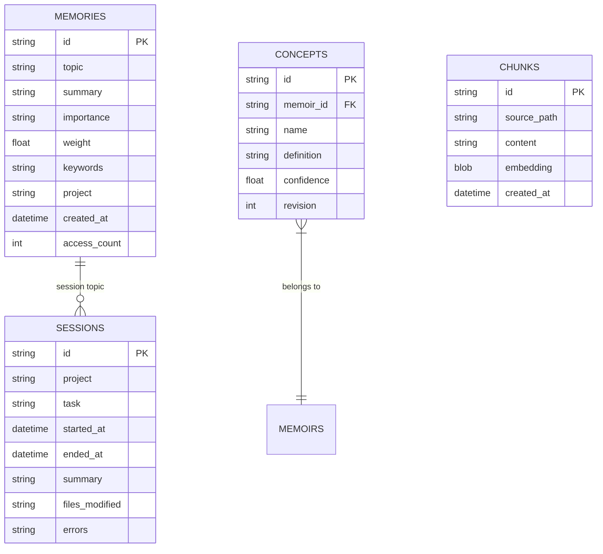
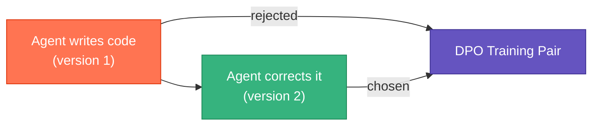

# Training Data from Hyphae

Hyphae accumulates data useful for fine-tuning LLMs on your team's coding patterns. This guide covers what data exists, what format it takes, and how it maps to training formats.

See the [ecosystem-level LLM Training Guide](https://github.com/basidiocarp/.github/blob/main/docs/LLM-TRAINING.md) for the full picture.

## What's in the Database



## Data Sources for SFT (Supervised Fine-Tuning)

### Decision Memories → Instruction Pairs

Topic: `decisions/{project}`

These are architecture decisions, technology choices, and conventions the agent learned. Each maps to an instruction/response pair.

```
Database:
  topic: "decisions/myapp"
  summary: "Switched from REST to gRPC for internal services because latency dropped from 45ms to 8ms"

Training pair:
  {"instruction": "What protocol do we use for internal services?",
   "response": "gRPC. We switched from REST because latency dropped from 45ms to 8ms."}
```

### Error Resolutions → Debugging Pairs

Topic: `errors/resolved`

Each resolved error is a (problem, solution) pair.

```
Database:
  topic: "errors/resolved"
  summary: "Command: cargo test\nError: thread panicked at auth.rs:42\nResolution: null check on token expiry"

Training pair:
  {"instruction": "cargo test fails with panic at auth.rs:42",
   "response": "Add a null check on token expiry. The JWT parser returns None for expired tokens but the code assumed Some."}
```

### Session Summaries → Task Completion Pairs

Topic: `session/{project}`

Session transcripts are user request → agent workflow pairs.

```
Database:
  topic: "session/myapp"
  summary: "Session in myapp: refactor auth middleware\nFiles: src/auth.rs, src/middleware.rs\nTools: Edit(5), Bash(12), Read(8)\nOutcome: Extracted JWT validation into separate module"

Training pair:
  {"instruction": "Refactor the auth middleware in myapp",
   "response": "Extracted JWT validation from auth.rs into a separate middleware.rs module. 5 file edits, verified with cargo test."}
```

## Data Sources for DPO (Preference Learning)

### Self-Corrections → Preference Pairs

Topic: `corrections`

Every time the agent writes code then immediately edits it, that's a (rejected, chosen) pair. In the current stack, Cortina records the structured correction signal and Hyphae stores the correction memory used for DPO export.



```
Database:
  topic: "corrections"
  summary: "File: auth.rs\nOriginal: fn validate(token: &str) { token.len() > 0 }\nCorrection: fn validate(token: &str) -> Result<Claims> { decode(token)? }"

Training triple:
  {"prompt": "Write a token validation function",
   "chosen": "fn validate(token: &str) -> Result<Claims> { decode(token)? }",
   "rejected": "fn validate(token: &str) { token.len() > 0 }"}
```

## Training Data Volume Estimates

After N agent sessions:

| Sessions | Decisions | Corrections | Error Fixes | Estimated SFT pairs | Estimated DPO pairs |
|----------|-----------|-------------|-------------|--------------------|--------------------|
| 10 | ~20 | ~5 | ~10 | ~30 | ~5 |
| 50 | ~100 | ~30 | ~60 | ~160 | ~30 |
| 200 | ~400 | ~120 | ~250 | ~650 | ~120 |
| 500 | ~1000 | ~300 | ~600 | ~1600 | ~300 |

A useful fine-tune requires roughly 1,000 SFT pairs and 500 DPO pairs for preference learning—approximately 200-500 active coding sessions.

## Export Format

The `hyphae export-training` command applies a default quality filter of `--min-weight 0.5 --min-recalls 1` before writing JSONL. `hyphae export-training-data` remains available as a compatibility alias:

**SFT format (JSONL):**
```jsonl
{"instruction": "...", "response": "..."}
```

**DPO format (JSONL):**
```jsonl
{"prompt": "...", "chosen": "...", "rejected": "..."}
```

**Alpaca format (for Axolotl):**
```jsonl
{"instruction": "...", "input": "", "output": "..."}
```

For DPO exports, Hyphae now prefers higher-effectiveness memories first when ranking the output pairs. If you need the old behavior, set `--min-weight 0 --min-recalls 0`.

If you need bespoke exports beyond `hyphae export-training`, you can query the database directly:

```sql
-- SFT pairs from decisions
SELECT summary FROM memories WHERE topic LIKE 'decisions/%' ORDER BY weight DESC;

-- DPO pairs from corrections
SELECT summary FROM memories WHERE topic = 'corrections' ORDER BY created_at DESC;

-- Error resolution pairs
SELECT summary FROM memories WHERE topic = 'errors/resolved' ORDER BY created_at DESC;
```

The database is at:
- macOS: `~/Library/Application Support/hyphae/hyphae.db`
- Linux: `~/.local/share/hyphae/hyphae.db`

## What to Fine-tune On

Start narrow. Pick one topic rather than dumping everything into training:

1. Company conventions: decisions topic only. Teaches the model how your team works.
2. Debugging patterns: errors/resolved topic. Teaches the model your common failure modes.
3. Code style: corrections topic as DPO. Teaches the model to write code the way you want it.

Each of these alone, with 500+ examples, produces a noticeable improvement in a fine-tuned Llama 3 or Mistral model.

## Related

- [Configuring Embeddings](guide.md#configuring-embeddings) — local vs HTTP embedding models
- [RAG Pipeline](../README.md#rag-pipeline) — how ingested documents are searched
- [Ecosystem LLM Training Guide](https://github.com/basidiocarp/.github/blob/main/docs/LLM-TRAINING.md) — full training infrastructure overview
